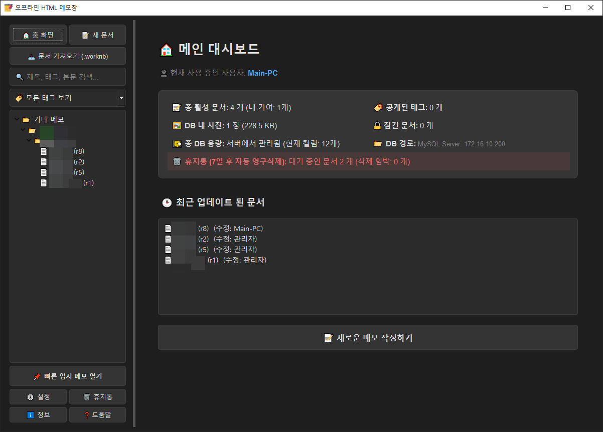

# memos

해당 코드는 AI를 이용하여 생성 되었습니다.
개인 업무 목적으로 단순하게 만든거라 이거저거 미흡한 점이나, 버그가 있을 수 있습니다.

# 📝 ckeditor를 이용한 HTML 메모장 (중앙 단말 제어 및 DB 동기화)

PyQt6 기반의 강력한 위키형 HTML 에디터 겸 호스트네임(Hostname) 기반의 중앙 단말 제어(MDM) 솔루션을 갖춘 하이브리드 메모장 시스템입니다. 사내망(로컬 SQLite3) 환경과 외부망(공용 MariaDB/MySQL 서버) 환경을 유연하게 오가며 개별 PC의 세션 무결성을 철저하게 보장합니다.



## ✨ 핵심 기능

1. **하이브리드 데이터베이스 엔진 (Zero-Config)**
   - `config.json` 설정을 감지하여 로컬 SQLite3와 원격 MariaDB(MySQL) 서버 연동을 유연하게 자동 전환합니다.
   - 대용량 이미지 자원이 본문에 Base64 형태로 포함되어도 안정적으로 저장 및 전송할 수 있도록 `LONGTEXT` 기반의 확장 스키마가 적용되어 있습니다.

2. **호스트네임(Hostname) 기반 단말 제어 및 세션 보호**
   - 물리적 단말의 컴퓨터 이름(`socket.gethostname()`)을 판별하여 사용자를 특정 PC에 강력하게 귀속(Lock-in)시킵니다.
   - 이미 지정된 PC에 매핑된 사용자 계정은 로컬/서버 환경을 막론하고 다른 PC에서 임의로 세션을 탈취하거나, 전환 및 삭제할 수 없도록 **세션 하이재킹 차단 로직**이 실시간으로 작동합니다.

3. **숨겨진 중앙 통제 패널 (One-Pass Provisioning)**
   - 사용자 추가 창에 마스터 비밀 주문인 `hiddenconfig`를 입력하면 이스터에그 관리자 패널이 활성화됩니다.
   - 관리자 패널을 통해 전사 단말기의 호스트네임 매핑 현황을 모니터링하고, [계정 생성 + PC 귀속]을 동시에 처리하는 **원패스 프로비저닝** 기능을 제공합니다.

4. **하이브리드 로컬 개인화 격리**
   - 공용 데이터(문서 내용, 사용자 풀, MDM 정책)는 중앙 데이터베이스를 공유하지만, 사용자의 UI 테마(다크/라이트), 화면 줌 배율, 프로그램 창 위치, 그리고 **좌측 트리 뷰 너비(Splitter State)**는 각자 PC의 로컬 세팅 테이블에 안전하게 격리 보존되어 타인에게 영향을 주지 않습니다.

## 🛠️ 개발 환경 및 기술 스택
- **Language:** Python 3.11+
- **UI Framework:** PyQt6, PyQt6-WebEngine (Chromium Core)
- **Database:** SQLite3 (Local File), MariaDB / MySQL (Remote Server)
- **Database Driver:** PyMySQL

## 관리자 모드 진입방법
- 설정에서 사용자 추가에 hiddenconfig 입력 후 추가 클릭 < 기본 / 코드상에서 검색 후 변경>

## 🚀 실행 및 빌드 안내

### 1. 필수 라이브러리 설치
```bash
pip install PyQt6 PyQt6-WebEngine pymysql
```

### 2. 애플리케이션 실행
```bash
python app.py
```

### 3. PyInstaller 단일 실행 파일 빌드 (--noconsole 대응)
```bash
pyinstaller --noconsole --onefile app.py
```

## 💽 데이터베이스 초기화
서버 환경(MariaDB/MySQL) 구축 시, 레포지토리에 포함된 `db.sql` 스크립트를 사용하여 인프라 테이블 스키마 및 마스터 기본 데이터를 손쉽게 초기화할 수 있습니다.
